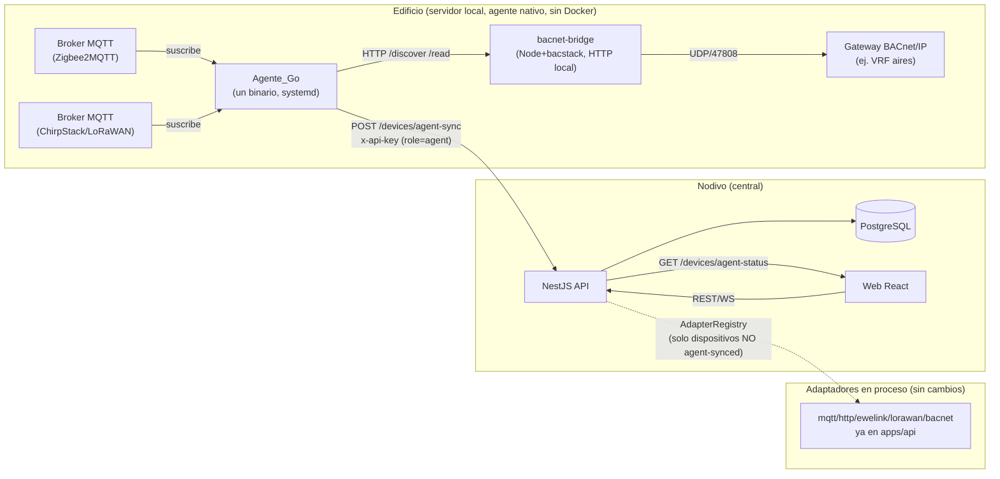
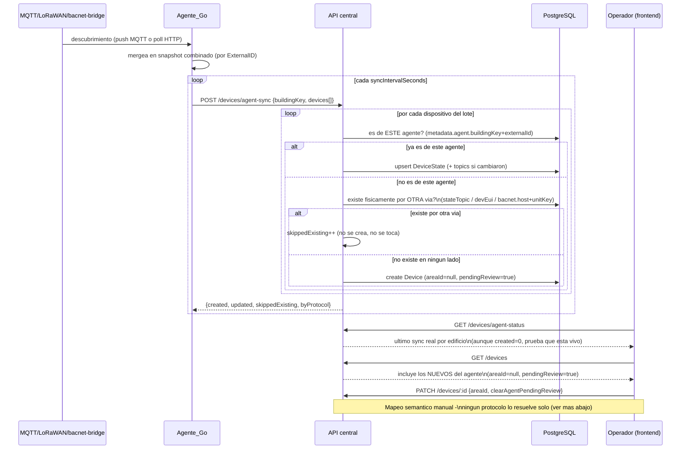

# Agente_Go

Agente en Go, uno por edificio, que corre en el servidor local de ese edificio y escucha los
protocolos IoT presentes en su red - **MQTT/Zigbee2MQTT, LoRaWAN (ChirpStack) y BACnet/IP ya
funcionan y estan probados contra infraestructura real**; HTTP por fabricante (Shelly, Tasmota...)
es la unica fase pendiente - reportando lo que descubre a la API central de Nodivo. Codigo en
[`apps/Agente_Go`](../apps/Agente_Go).

Este documento es la contraparte de [`architecture.md`](./architecture.md) mirando especificamente
esta pieza: por que existe, como se integra con lo que ya habia, que cambio en la base de datos, y
el roadmap de fases (de donde sale este documento: fue una conversacion de diseño antes de escribir
una sola linea de Go, no al reves).

## Por que existe

Hasta ahora, cada edificio que este proyecto soporta (empezando por TEC 3) tiene sus dispositivos
gestionados **dentro** de `apps/api`: los adaptadores MQTT/HTTP/eWeLink/BACnet corren en el mismo
proceso NestJS y hablan directo a la red del edificio. Eso funciona mientras la API central pueda
alcanzar esa red (mismo LAN, o BACnet-bridge como workaround para el caso Windows/Docker).

Para un edificio **nuevo**, la API central probablemente no esta en la misma red que sus
dispositivos. El patron estandar de la industria (Niagara, Honeywell, KNX-IP gateways, Home
Assistant) es un agente/gateway local por sitio que si tiene acceso a esa red, y que habla hacia
afuera con la nube central por una sola conexion saliente HTTP - sin abrir puertos, sin VPN por
edificio. `Agente_Go` es esa pieza.

## Decision de arquitectura: agente delgado, cerebro central

Se evaluaron dos caminos (ver la discusion completa en el historial del proyecto):

- **Agente delgado (elegido):** el agente solo descubre y traduce protocolo -> HTTP hacia el API
  central existente. Reusa toda la logica de negocio ya construida (auth, reglas de automatizacion,
  WebSocket, la UI entera). Un edificio sin internet no puede operar via Nodivo (limitacion
  aceptada).
- **Agente "gordo" standalone** (descartado por ahora): el agente traeria su propia mini-API + DB +
  UI local por edificio. Mas resiliente a cortes de internet, pero duplica auth/reglas/UI en dos
  stacks distintos. Revisar esta decision si en el futuro los edificios reales no tienen
  conectividad confiable.

## Vista general



Los dos caminos (adaptadores en proceso, `Agente_Go`) conviven en el mismo `AdapterRegistry`/API
sin pisarse: un dispositivo creado por `agent-sync` nunca pasa por
`adapterRegistry.resolve(...).onDeviceRegistered()` (ver "Cambios en el backend" abajo), asi que
ningun adaptador en proceso intenta manejarlo. Y al reves: `agent-sync` nunca toca un dispositivo
que ya gestiona un adaptador en proceso - ver "Como se evitan los duplicados" mas abajo.

## Ciclo de sincronizacion



## Cambios en la base de datos

Una sola migracion, sin tocar ninguna tabla existente mas que el enum:

```sql
-- 20260923234259_add_agent_role
ALTER TYPE "Role" ADD VALUE 'agent';
```

`Role` ahora es `admin | operator | viewer | agent`. Una API key con `role: agent` solo puede pasar
el `RolesGuard` de `POST /devices/agent-sync` (y los endpoints publicos `GET /devices*`); todo lo
demas (crear usuarios, borrar dispositivos, otras API keys) le da 403, verificado en pruebas reales
contra la API viva.

**No se agrego ninguna tabla ni columna nueva.** El resto de la informacion que necesita el agente
vive en `Device.metadata` (ya era `Json?`, el mismo campo donde ya viven `http`, `bacnet`,
`ewelink`, `mqttJson`, `group`, `tags`):

```jsonc
// Device.metadata para un dispositivo creado por agent-sync
{
  "agent": {
    "buildingKey": "tec3-nivel10",   // de donde vino
    "externalId": "mqtt:Dimmer_Oficina3", // su identidad estable en esa red
    "source": "go-agent",
    "discoveredAt": "2026-09-23T23:44:33.005Z",
    "pendingReview": true            // nadie lo asigno a un area todavia
  }
}
```

Se eligio `metadata` en vez de columnas nuevas por la misma razon que ya se uso para BACnet/eWeLink/
Zigbee2MQTT en este proyecto: es informacion especifica de esta forma de llegada, no algo que todas
las 1000+ filas de `devices` necesiten, y evita una migracion nueva por cada dato que el agente
quiera adjuntar mas adelante.

### Diagrama de datos

```mermaid
erDiagram
  Device ||--o| DeviceState : "1 a 1"
  Area ||--o{ Device : "opcional (areaId)"
  Tenant ||--o{ Area : contiene

  Device {
    string id PK
    string name
    enum protocol "mqtt | http | ewelink | lorawan | bacnet"
    enum kind "switch | sensor | climate"
    string stateTopic "NULL si no es controlable"
    string commandTopic "solo si es controlable (mqtt)"
    string areaId FK "NULL hasta que un humano lo asigna"
    json metadata "http | bacnet | ewelink | mqttJson | group | tags | agent"
  }

  DeviceState {
    string deviceId PK_FK
    string state "on/off/online/offline"
    json readings
    datetime updatedAt
  }

  note1["Device.metadata.agent (solo si lo trajo un Agente_Go):<br/>buildingKey, externalId, source,<br/>discoveredAt, pendingReview"]
  Device .. note1

  EventLog {
    string id PK
    string type "ej. agent.sync"
    json payload "buildingKey, created, updated,<br/>skippedExisting, byProtocol, syncedAt"
    datetime createdAt
  }

  ApiKey {
    string id PK
    enum role "admin | operator | viewer | agent"
    string keyHash
  }
```

Una sola migracion real para todo esto: `ALTER TYPE "Role" ADD VALUE 'agent'` (ver abajo). Todo lo
demas (`metadata.agent`, el reporte de sync) vive en columnas `Json?` que ya existian
(`Device.metadata`, `EventLog.payload`) - cero tablas nuevas.

## Por que el mapeo semantico no se automatiza (y no va a automatizarse)

El agente puede descubrir con certeza que "existe un dispositivo MQTT llamado
`Dimmer_Tira_Led_Oficina3`". Ningun protocolo (MQTT, BACnet, lo que sea) le puede decir en que
sala fisica esta ni como se llama para un humano - eso ya se vivio en este mismo proyecto: ubicar
los AC B3/B4 en el plano isometrico requirio cruzar su rango de temperatura real contra una captura
de pantalla de la app del fabricante, no habia otra forma. Por eso todo dispositivo nuevo del
agente llega con `areaId: null` y `pendingReview: true`, y el flujo para asignarlo a un area sigue
siendo el mismo que ya existe (`PATCH /devices/:id { "areaId": "..." }` desde el frontend) - no se
construyo ninguna pantalla nueva para esto todavia (ver Fase 3 abajo).

## El diseño del frontend no cambia (mas una pestaña nueva)

`Devices.tsx` y `BuildingView.tsx` ya renderizan cualquier fila de `devices` sin que les importe si
la creo un formulario manual, un import de Home Assistant, o ahora `Agente_Go` - el contrato es la
misma tabla `Device`/`DeviceState` de siempre. Lo unico que se agrego es una pestaña **"Agente Go"**
(`apps/web/src/routes/AgentDevices.tsx`), con las mismas tarjetas/secciones por categoria que Vista
Operativa (reusa los mismos componentes: `SectionHeader`, `DeviceIconBadge`, `StatTile`), mas:

- **Panel "Actividad del agente"**: el ultimo sync real de cada `buildingKey`, con cuantos
  dispositivos vio por protocolo - EXISTE AUNQUE `created=0` (un edificio ya totalmente importado
  autodescubre todo pero no crea filas nuevas; eso es exito, no silencio). Viene de
  `GET /devices/agent-status`, que lee el ultimo `EventLog` tipo `agent.sync` de cada edificio.
- **Cola de confirmacion**: un dispositivo nuevo sin area, con selector de area + botones
  Confirmar/Descartar, igual que se describia antes.

Un dispositivo MQTT (switch) que el agente reporta con `stateTopic`/`commandTopic` reales
**queda controlable de verdad apenas se confirma** - no solo lectura. Se verifico en vivo: se
confirmo un switch de prueba, se envio un comando real, y llego tal cual al broker
(`{"state":"ON"}` en el topic de comando real) - mismo mecanismo que ya usa "Sin Home Assistant
(MQTT directo)". Para dispositivos que SI siguen sin canal de control (BACnet, LoRaWAN, o MQTT sin
topics), la UI muestra un badge "Solo lectura" con el estado real en vez de un toggle que fallaria
en silencio (`isAgentReadOnly()` en `api/devices.ts` decide esto por dispositivo, no por
protocolo entero).

**Limitacion que sigue pendiente:** BACnet y LoRaWAN no tienen canal de comandos de vuelta
(LoRaWAN nunca lo va a tener - son sensores; BACnet climatizacion si lo necesitaria) - eso sigue
siendo Fase 3.

## Roadmap de fases

| Fase | Que hace | Estado |
|---|---|---|
| 0 | Contrato agente<->API: rol `agent`, endpoint `agent-sync`, `metadata.agent` | ✅ hecho |
| 1 | Driver MQTT/Zigbee2MQTT, agente completo compilando y probado end-to-end | ✅ hecho |
| 1.5 | Dispositivos MQTT controlables de verdad tras confirmarlos (no solo lectura) | ✅ hecho |
| 2 | Driver LoRaWAN (via MQTT, ChirpStack) | ✅ hecho |
| 2 | Driver BACnet (via `apps/bacnet-bridge`, no BACnet/IP nativo en Go) | ✅ hecho |
| 3 | UI de "dispositivos por confirmar" | ✅ hecho (pestaña "Agente Go") |
| 3 | Deduplicar contra dispositivos ya importados por los flujos manuales existentes | ✅ hecho - ver abajo |
| 3 | Panel de actividad real por protocolo (`GET /devices/agent-status`) | ✅ hecho |
| 3 | Canal de comandos de vuelta agente<-API para protocolos no-MQTT (bacnet) | pendiente |
| 4 | Adaptadores HTTP por fabricante (Shelly, Tasmota...) como plugins del agente | pendiente |
| 5 | Empaquetado (releases por SO/arch), instalacion como servicio | parcial (ver README, systemd) |
| 6 | Piloto en un segundo edificio real | pendiente |
| 7 | Driver Modbus TCP (`modbussource`) + pestaña **Sedes** (IGSS Escuintla como sede modelo) | ✅ hecho - ver abajo |
| 8 | Eventos en el agente (`internal/events`): deteccion en tiempo real, buffer en disco, historial `SiteEvent`, pestaña Sedes > Eventos | ✅ hecho - ver `docs/sedes-igss.md` |

### Sedes IGSS: Modbus TCP + LoRaWAN (sede modelo Escuintla)

> Documento completo y actualizado (incluye eventos, cadena de frio y el hallazgo de los
> generadores): **`docs/sedes-igss.md`**. Lo de abajo es el resumen de la fase 7.

- **Config**: `apps/Agente_Go/config.igss-escuintla.example.yaml` (`buildingKey: igss-escuintla`).
  Para otra sede se copia y se cambian IPs y la lista de equipos; el codigo no cambia.
- **Modbus**: el EBO AS-P de la sede (10.0.6.26, unit 1) concentra los 6 ION7400, los 7 PM2130 y
  los 2 generadores, cada uno en un bloque fijo de registros. `modbussource` aplica un **perfil**
  por modelo (`ion7400`, `ion7400-b`, `pm2130`, `generator` en `modbussource/profiles.go`) copiado
  del lector que ya funciona en produccion (`api-SIASA/modbus_cliente/lectura_Ebo_v2.js`): registro
  N = direccion N-1, float32 ABCD con respaldo CDAB, THD/flicker con escala autodetectada, generador
  int32 CDAB ×0.01. Cliente Modbus propio (funciones 03/04 solamente): **el agente no puede escribir**.
- **Autodescubrimiento**: Modbus no permite preguntar "que equipos hay". Cada ciclo el agente lee
  todos los bloques configurados y solo reporta los que traen datos validos para su perfil; un
  equipo ya visto que deja de responder pasa a `offline`.
- **LoRaWAN**: `lorawansource` ahora reporta tambien `model` (`deviceProfileName` de ChirpStack),
  los tags del dispositivo (`tag_area`, `tag_code`, `tag_sensor_type`...) y RSSI/SNR/fCnt del ultimo uplink.
- **API**: `protocol=modbus` (adaptador pasivo de solo lectura), `metadata.model` y
  `metadata.attributes` desde `agent-sync`, historial en `DeviceReading` (max. 1 fila/min por
  equipo) y rangos `1h`/`24h` en `GET /devices/:id/history`.
- **Web**: pestaña **Sedes** (`routes/Sedes.tsx`, `components/sedes/*`): energia (generadores,
  ION7400, PM2130) y sensores LoRaWAN (puertas S595, EVA, WISE, calidad de aire S592) con boton de
  tendencias por tarjeta. Si el agente de la sede modelo aun no reporto, muestra datos de demostracion marcados como tales.
- **Verificado en vivo (2026-10-08)**, desde una PC en la red, contra el EBO y ChirpStack reales:
  14/15 equipos Modbus con datos coherentes (≈125 V, 59.96 Hz, cargas reales por fase, S1 comercial = 1)
  y 88 sensores LoRaWAN en los primeros minutos. **Pendiente de revisar en sitio**: el bloque del
  "Generador Módulos" (5743-5779) esta todo en 0 en el EBO, y el de "Generador Planta Hospital" solo
  tiene 3 registros distintos de 0 (bateria = 27 crudo, que con la escala ×0.01 de api-SIASA da
  0.27 V) - el controlador del generador probablemente no esta publicando sus datos al EBO.

### Por que BACnet no habla el protocolo directo en Go

Se probo en vivo (no se asumio) la unica libreria BACnet/IP nativa de Go razonablemente madura,
`alexbeltran/gobacnet`, contra el gateway real de este proyecto (AC Smart 5, `10.3.0.11`):
`WhoIs` encuentra el dispositivo correctamente (deviceId 9000, vendorId 432), pero `ReadProperty`
no devuelve NINGUN dato utilizable para ninguna propiedad, ni siquiera un `PresentValue` simple de
un solo punto - sin error de protocolo, simplemente una respuesta vacia. En vez de reimplementar
BACnet/IP desde cero sin poder validarlo contra hardware real (exactamente el tipo de atajo que
este proyecto evita, ver la nota sobre eWeLink en las memorias de la sesion), `bacnetsource` es un
cliente HTTP de `apps/bacnet-bridge` - el mismo puente Node+bacstack que ya prueba la API central,
ya verificado contra este gateway. El bridge debe correr aparte (ver su propio README) en una
maquina que alcance el gateway BACnet por UDP - puede ser la misma maquina que el agente.

### Como se evitan los duplicados (sin tocar nada de lo que ya existe)

Primer intento de este agente: solo reconocia como "ya existe" un dispositivo con
`metadata.agent.{buildingKey,externalId}` - un campo que SOLO tienen los dispositivos creados por
un agente. Correr el agente contra el broker LoRaWAN real y el gateway BACnet real de TEC 3
duplicaba los 13 AC y varios sensores que ya existian por los flujos manuales
(`BacnetImportService`, el adaptador LoRaWAN en proceso). Esto se encontro probando en vivo, no en
teoria, y se corrigio antes de dar la fase por terminada.

**La solucion**: `AgentSyncService.findExistingByPhysicalIdentity()` busca, antes de crear nada, un
dispositivo YA EXISTENTE (creado por cualquier via) que sea fisicamente el mismo, usando la
identidad real de cada protocolo - no el `externalId` del agente, que un import manual nunca
conoce:

| Protocolo | Como se identifica el "mismo" dispositivo |
|---|---|
| `mqtt` | mismo `stateTopic` (el topico real del broker) |
| `lorawan` | mismo `devEui` (asi lo identifica el adaptador LoRaWAN en proceso) |
| `bacnet` | mismo `host` + `unitKey` (asi lo identifica `BacnetImportService`) |

Si encuentra una coincidencia, **no crea nada y no toca ese dispositivo para nada** - ni su
`DeviceState`, ni su `areaId`, ni su nombre. El dispositivo original sigue con su adaptador en
proceso como unica fuente de verdad; el agente simplemente reconoce "esto ya esta gestionado" y
sigue. Solo cuenta cuantos reconocio asi (`skippedExisting`) para que quede visible que los vio,
no que fallo en silencio.

**Verificado en vivo, dos veces, con dedup activo**: correr el agente contra el gateway BACnet real
(`10.3.0.11`, 13 unidades) y el broker LoRaWAN real (`192.168.70.6`) - conteo de dispositivos
`bacnet`/`lorawan` en la base de datos **identico antes y despues** (14/19), `metadata.agent`
creado por el agente: **0**. El log del agente mostro `nuevos=0 actualizados=0 ya-existian=19` -
autodescubrio 19 dispositivos reales, reconocio los 19 como ya gestionados, no duplico ni uno.

## Verificacion real hecha (acumulada, todas las fases)

No solo compila: cada pieza se probo contra la API viva y, donde existia, contra hardware/broker
reales antes de darla por terminada.

- `go build ./...` y `go vet ./...` limpios (Go 1.24, via contenedor `golang:1.24` - no hay
  toolchain de Go instalado en esta maquina de desarrollo). Cross-compile real a `windows/amd64`
  (para correr nativo en esta maquina) y `linux/amd64` (el SO del servidor 192.168.70.4).
- **MQTT**: `POST /devices/agent-sync` llamado dos veces con el mismo `externalId` - la primera
  crea, la segunda actualiza (no duplica) y refleja el cambio de estado. Un switch confirmado con
  `commandTopic` real recibio un comando real y se vio llegar al broker.
- **LoRaWAN**: conectado en vivo a `192.168.70.6:1883` (confirmado alcanzable por ping/TCP desde
  esta maquina) - trajo sensores reales con lecturas reales (CO2, humedad, temperatura, PIR).
- **BACnet**: se descarto una libreria Go nativa tras probarla en vivo contra `10.3.0.11` y
  encontrar que no decodifica respuestas reales (ver arriba); el reemplazo (`bacnet-bridge` via
  HTTP) trajo los 13 AC reales con temperaturas reales en ~2.5 segundos.
- **Dedup**: conteo de dispositivos `bacnet`/`lorawan` identico antes y despues de correr el agente
  contra la infraestructura real de TEC 3 (14/19 -> 14/19), `0` filas nuevas con `metadata.agent`,
  log del agente confirmando `ya-existian=19`.
- Rol `agent`: esa API key recibe 403 en `GET /users` (no escala privilegios).
- `GET /devices/agent-status` verificado devolviendo el desglose real por protocolo
  (`{"bacnet":13,"lorawan":6}`) del ultimo sync contra TEC 3.
- Se verificaron y borraron los dispositivos/API keys de prueba de cada ronda antes de cerrarla -
  no quedo nada de prueba en la base de datos real (los datos reales de TEC 3 descubiertos por el
  agente SI se dejaron, porque son el mismo dato que ya existia - el dedup no creo nada nuevo que
  limpiar).
