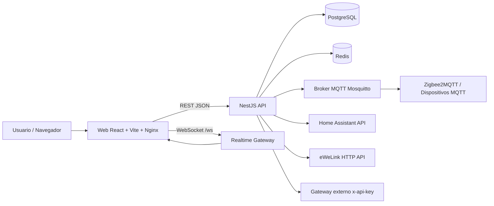
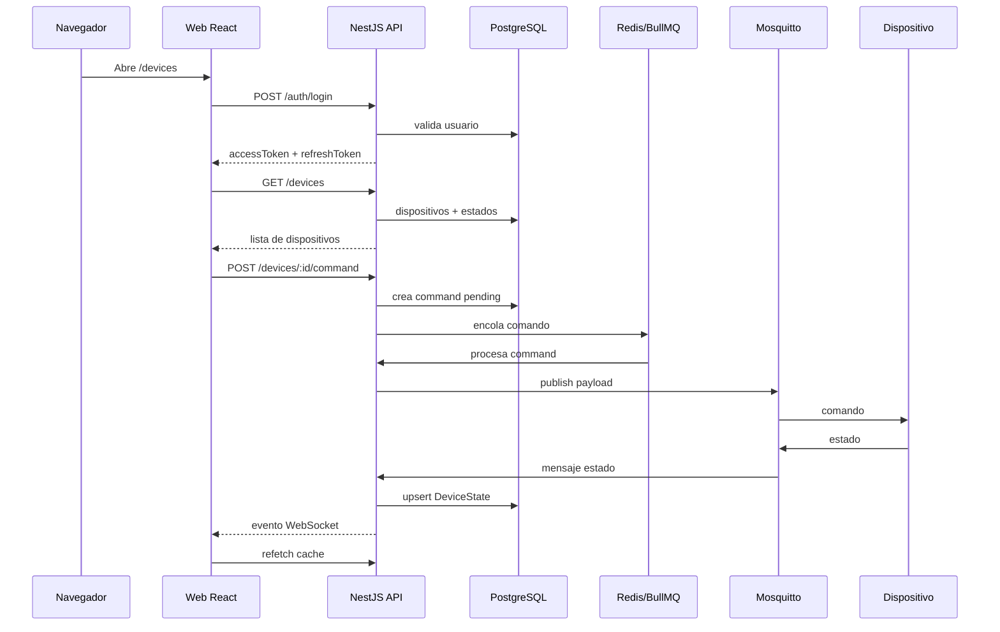
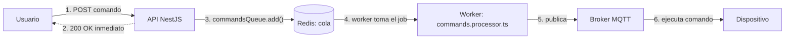
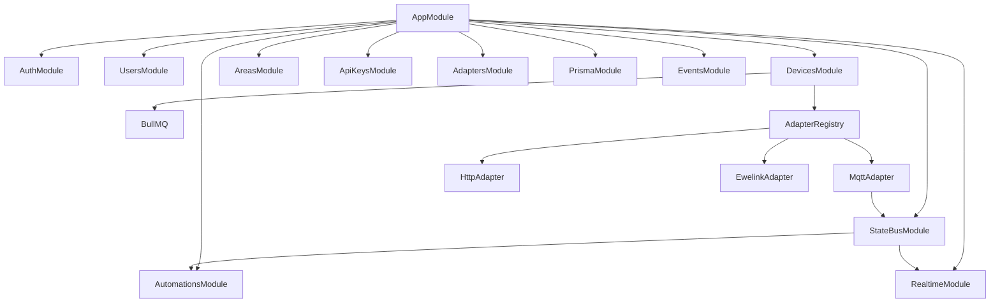

# Arquitectura

## Vista General

## Componentes

### Web

Ubicacion: `apps/web`

Responsabilidades:

- Login y persistencia de sesion con Zustand.
- Panel clasico de dispositivos.
- Vista de edificio con imagenes, areas y poligonos.
- Gestion inteligente de automatizaciones.
- Importacion desde Home Assistant y MQTT/Zigbee2MQTT.
- Consumo REST via Axios y sincronizacion con React Query.
- Actualizacion en tiempo real via WebSocket.

### API

Ubicacion: `apps/api`

Responsabilidades:

- Autenticacion JWT y refresh tokens.
- Gestion de usuarios y API keys.
- CRUD de dispositivos.
- Despacho de comandos por MQTT, HTTP/Home Assistant y eWeLink.
- Lectura de estados y publicacion al bus interno.
- Areas/tenants para la vista de edificio.
- Reglas de automatizacion por estado y horario.
- Gateway externo opcional para integraciones con `x-api-key`.

### Infraestructura

Servicios de `docker-compose.yml`:

- `postgres`: base de datos.
- `redis`: cola BullMQ.
- `mosquitto`: broker MQTT.
- `api`: backend NestJS.
- `web`: frontend estatico servido con Nginx.

## Comunicacion Principal

## Cola de Comandos (Redis)

Redis no guarda datos de negocio (eso es Postgres): es el backend de BullMQ, la
cola de trabajos para comandos hacia dispositivos. La API responde al usuario
de inmediato sin esperar al dispositivo; el envio real ocurre en paralelo via
un worker que consume la cola.

Si la API se reinicia entre el paso 3 y el 4, el job sigue en Redis y el
worker lo retoma apenas vuelve a levantar. Sin Redis, ese job viviria solo en
la memoria del proceso y se perderia.

## Modulos Backend

