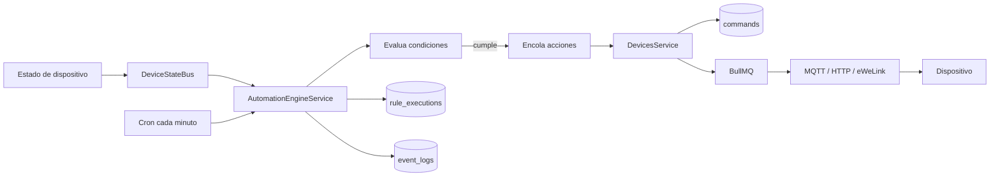

# Automatizaciones

Las automatizaciones permiten ejecutar acciones sobre dispositivos cuando se cumple un disparador y condiciones opcionales.

## Flujo



## Tipos de Trigger

### Estado de Dispositivo

Ejecuta una regla cuando un dispositivo reporta estado y coincide con `operator` + `value`.

Ejemplo conceptual:

```json
{
  "type": "device_state",
  "deviceId": "...",
  "operator": "eq",
  "value": "on"
}
```

### Horario

Ejecuta una regla a una hora local `HH:mm`. Puede limitarse por dias de semana.

```json
{
  "type": "schedule",
  "scheduleTime": "18:30",
  "scheduleDays": [1, 2, 3, 4, 5]
}
```

Donde `0=domingo` y `6=sabado`.

## Condiciones

Las condiciones son `AND`: todas deben cumplirse para ejecutar acciones.

## Acciones

Cada accion envia `on` u `off` a un dispositivo. Puede tener `delayMs` para retardar la ejecucion.

## Consideraciones

- El motor evita disparar dos veces el mismo trigger horario dentro del mismo minuto.
- Las reglas que reaccionan a estados pueden generar ciclos si una accion causa el mismo estado que dispara otra regla.
- Las ejecuciones se registran en `rule_executions`.

