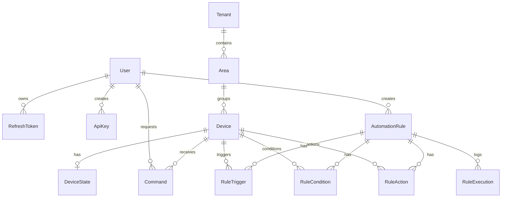

# Base de Datos

Motor: PostgreSQL 16  
ORM: Prisma

## Modelo Principal

## Tablas Relevantes

- `users`: usuarios del sistema.
- `refresh_tokens`: tokens persistentes.
- `api_keys`: integraciones externas.
- `tenants`: contexto de edificio/nivel.
- `areas`: areas fisicas con imagen y poligonos.
- `devices`: dispositivos IoT.
- `device_states`: ultimo estado conocido.
- `commands`: comandos enviados a dispositivos.
- `automation_rules`: reglas.
- `rule_triggers`: disparadores.
- `rule_conditions`: condiciones.
- `rule_actions`: acciones.
- `rule_executions`: ejecuciones historicas.
- `event_logs`: auditoria de eventos.

## Migraciones Actuales

- `20260909205906_init`: esquema inicial.
- `20260911165500_add_ewelink_protocol`: soporte eWeLink.
- `20260914154643_add_api_keys`: API keys.
- `20260917005313_add_tenant_area`: tenants, areas y relacion device-area.
- `20260917021941_add_area_points`: poligonos para areas.
- `20260917161123_add_schedule_trigger`: triggers por horario.

## Seed

`apps/api/prisma/seed.ts` crea el usuario admin si no existe. Tambien puede crear areas iniciales solo si no hay ningun tenant configurado. Esto evita duplicar areas cuando se restaura data real desde ambiente local.

