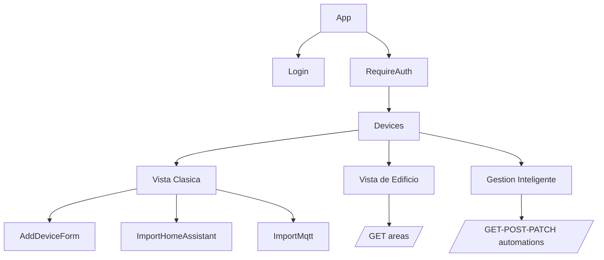

# Frontend

Ubicacion: `apps/web`

## Rutas

| Ruta | Componente | Descripcion |
| --- | --- | --- |
| `/login` | `Login.tsx` | Inicio de sesion |
| `/devices` | `Devices.tsx` | Panel autenticado |
| `*` | Redirect | Redirige a `/devices` |

## Vistas del Panel

`Devices.tsx` administra tres modos:

1. **Clasico**: tarjetas/listas de dispositivos, grupos, sensores, importacion y edicion.
2. **Vista de edificio**: plano con areas, poligonos, imagenes y dispositivos por area.
3. **Gestion Inteligente**: CRUD visual de reglas de automatizacion.



## Estado y Datos

- `zustand`: tokens y usuario autenticado.
- `@tanstack/react-query`: cache y refetch de dispositivos, areas y reglas.
- `axios`: cliente REST.
- `WebSocket`: refresca cache cuando cambian estados.

## Assets

Las imagenes de areas estan en:

```text
apps/web/public/areas/
```

Archivos destacados:

- `isometrico-general-1.jpg`: plano principal de la vista de edificio.
- `planta-general.jpg`: planta general.
- Imagenes por area: `cctv.jpg`, `sala-presidencial.jpg`, `oficina-3.jpg`, etc.

