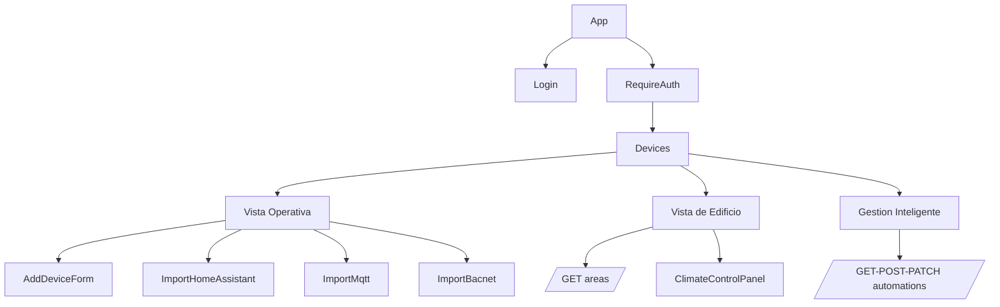

# Frontend

Ubicacion: `apps/web`

## Rutas

| Ruta | Componente | Descripcion |
| --- | --- | --- |
| `/login` | `Login.tsx` | Inicio de sesion |
| `/devices` | `Devices.tsx` | Panel autenticado |
| `*` | Redirect | Redirige a `/devices` |

## Vistas del Panel

`Devices.tsx` administra tres modos (pestañas "Vista Operativa" / "Vista de Edificio" /
"Gestion Inteligente" - sin el prefijo "Opcion N" que tenian antes):

1. **Vista Operativa**: tarjetas/listas de dispositivos agrupadas por categoria (Iluminacion,
   Climatizacion, Sensores, Toma/Switch, ...) via `inferDeviceKind`; cada seccion tiene su propio
   encabezado colapsable (clic para expandir/ocultar) y las tarjetas dentro quedan ordenadas
   alfabeticamente. Incluye tarjetas de conteo por protocolo (MQTT/HTTP/BACnet/LoRaWAN/eWeLink).
2. **Vista de edificio**: plano isometrico con areas, poligonos, imagenes y dispositivos por area;
   cada area muestra ademas una burbuja individual por cada equipo de climatizacion (A/C) asignado,
   con su propio estado encendido/apagado en tiempo real.
3. **Gestion Inteligente**: CRUD visual de reglas de automatizacion.


```mermaid
flowchart TB
  App --> Login
  App --> RequireAuth
  RequireAuth --> Devices
  Devices --> Classic[Vista Operativa]
  Devices --> BuildingView[Vista de Edificio]
  Devices --> Automations[Gestion Inteligente]
  Classic --> AddDeviceForm
  Classic --> ImportHomeAssistant
  Classic --> ImportMqtt
  Classic --> ImportBacnet
  BuildingView --> AreasAPI[/GET areas/]
  BuildingView --> ClimateControlPanel
  Automations --> AutomationsAPI[/GET-POST-PATCH automations/]
```

> Dispositivos que llega a crear un `Agente_Go` (ver [`agente-go.md`](./agente-go.md)) se
> renderizan con este mismo codigo sin cambios - no hay una vista ni un componente distinto para
> ellos, solo aparecen como tarjetas sueltas sin area hasta que alguien los asigna manualmente.

## Estado y Datos

- `zustand`: tokens y usuario autenticado.
- `@tanstack/react-query`: cache y refetch de dispositivos, areas y reglas.
- `axios`: cliente REST.
- `WebSocket`: refresca cache cuando cambian estados.

## Assets

Las imagenes de areas estan en:

```text
apps/web/public/areas/
```

Archivos destacados:

- `isometrico-general-1.jpg`: plano principal de la vista de edificio.
- `planta-general.jpg`: planta general.
- Imagenes por area: `cctv.jpg`, `sala-presidencial.jpg`, `oficina-3.jpg`, etc.

